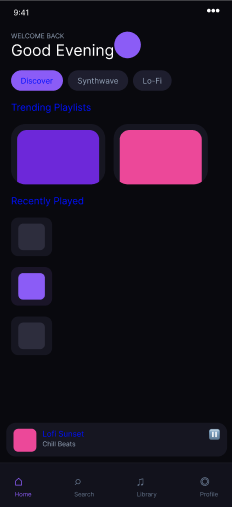
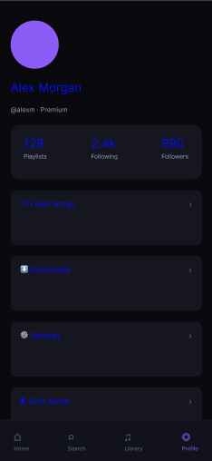
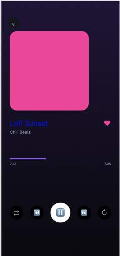

# Aether Music App UI

A mobile music app UI I put together for my portfolio. I was going for a late-night listening feel — dark UI, purple and pink accents, soft cards on a deep background.

## Links

| | |
|---|---|
| [Figma file](https://www.figma.com/design/vwYzAz8AjBmz9okh2rLEyM/Aether-Music-App-UI?node-id=5-7) | Main designs (390×844) |
| [Figma prototype](https://www.figma.com/proto/vwYzAz8AjBmz9okh2rLEyM/Aether-Music-App-UI?node-id=5-7) | Tap-through in Figma |
| [HTML prototype](./prototype/index.html) | Same flows in the browser |
| [Project page](./index.html) | Hub with screenshots |

## What I built

I started in **Figma** — five screens (Home, Search, Library, Profile, Now Playing), colour variables, and a simple component set. After that I rebuilt the main flows in **HTML/CSS/JS** so people can click through without opening Figma. Tab bar switches screens; playlist cards, tracks, and the mini player open the full player; back returns you to where you were.

To run the prototype locally:

```bash
npx serve prototype
```

Then open `http://localhost:3000`.

## Screenshots

| Home | Profile | Now Playing |
|------|---------|-------------|
|  |  |  |

## Colours & type

- **Font:** Plus Jakarta Sans  
- **Purple** `#8B5CF6` · **Pink** `#EC4899` · **Cyan** `#06B6D4`  
- **Background** `#09090E` · **Surface** `#161621`  
- **Frame:** iPhone 14 (390 × 844)

## Files

- `index.html` — project overview  
- `prototype/` — interactive demo  
- `screenshots/` — exports from Figma  

Still a work in progress — I want to finish the Behance case study and add a couple more screen captures when I have time.

**Tenzin Jigme**
